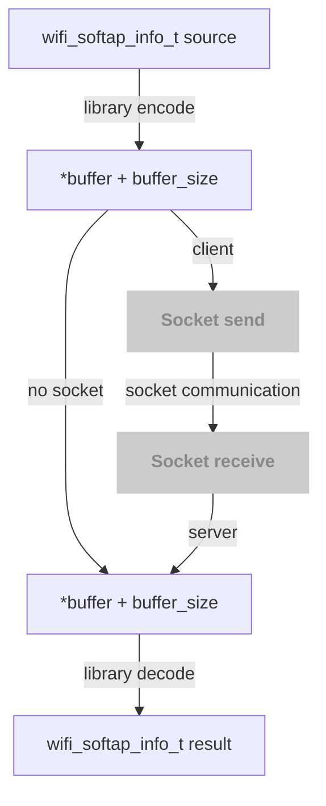

# serialization demo for c with libraries
Use same sample structure and encode / decode by the libries, and send the byte through socket

## Library
- [tpl](https://github.com/troydhanson/tpl)
- [mapck](https://github.com/ludocode/mpack)
- [nanopb](https://github.com/nanopb/nanopb)

## Compare
### Environment
- CPU: 12th Gen Intel Core i9-12900K
- RAM: 64G
- OS: Ubuntu 20.04.4 LTS

### Table
- The bytes are the size of the encoded result bytes from different size of structures
- The nanoseconds are the average time and standard deviation(Stddev) of 300000 executions

#### malloc buffer
| Library               | tpl                                                | mpack                                              | nanopb                                             |
| --------------------- | -------------------------------------------------- | -------------------------------------------------- | -------------------------------------------------- |
| license               | BSD license                                        | MIT license                                        | zlib License                                       |
| serializtion format   | tpl image                                          | MessagePack                                        | protobuf                                           |
| single structure      | 118 bytes<br>Mean: 734.51 ns<br>Stddev: 50.50 ns   | 46 bytes<br>Mean: 159.00 ns<br>Stddev: 18.31 ns    | 51 bytes<br>Mean: 539.95 ns<br>Stddev: 32.39 ns    |
| array of 2 structure  | 199 bytes<br>Mean: 1131.37 ns<br>Stddev: 185.32 ns | 97 bytes<br>Mean: 318.22 ns<br>Stddev: 248.23 ns   | 110 bytes<br>Mean: 1560.68 ns<br>Stddev: 176.31 ns |
| array of 10 structure | 791 bytes<br>Mean: 2799.08 ns<br>Stddev: 355.14 ns | 481 bytes<br>Mean: 1124.34 ns<br>Stddev: 385.39 ns | 550 bytes<br>Mean: 6732.55 ns<br>Stddev: 355.55 ns |

##### Coefficient of Variation
| Library               | tpl    | mpack        | nanopb |
| --------------------- | ------ | ------------ | ------ |
| single structure      | 6.88%  | 11.52%       | 6.00%  |
| array of 2 structure  | 16.38% | ***78.01%*** | 11.30% |
| array of 10 structure | 12.69% | ***34.28%*** | 6.20%  |

#### stack buffer
| Library               | tpl                                               | mpack                                            | nanopb                                             |
| --------------------- | ------------------------------------------------- | ------------------------------------------------ | -------------------------------------------------- |
| license               | BSD license                                       | MIT license                                      | zlib License                                       |
| serializtion format   | tpl image                                         | MessagePack                                      | protobuf                                           |
| single structure      | 118 bytes<br>Mean: 706.13 ns<br>Stddev: 28.68 ns  | 48 bytes<br>Mean: 116.90 ns<br>Stddev: 12.12 ns  | 53 bytes<br>Mean: 552.10 ns<br>Stddev: 33.00 ns    |
| array of 2 structure  | 199 bytes<br>Mean: 1014.94 ns<br>Stddev: 22.79 ns | 97 bytes<br>Mean: 214.71 ns<br>Stddev: 9.10 ns   | 110 bytes<br>Mean: 1478.16 ns<br>Stddev: 36.23 ns  |
| array of 10 structure | 791 bytes<br>Mean: 2376.62 ns<br>Stddev: 46.58 ns | 481 bytes<br>Mean: 837.03 ns<br>Stddev: 36.99 ns | 550 bytes<br>Mean: 6768.58 ns<br>Stddev: 129.90 ns |

##### Coefficient of Variation
| Library               | tpl   | mpack  | nanopb |
| --------------------- | ----- | ------ | ------ |
| single structure      | 4.06% | 10.37% | 5.98%  |
| array of 2 structure  | 2.25% | 4.24%  | 2.45%  |
| array of 10 structure | 1.96% | 4.42%  | 1.92%  |

## Usage
```shell
usage: ./serialize_demo SHOW_STRUCTURE(0/1) LIBRARY COMMAND
LIBRARY: tpl|mpack|nanopb
COMMAND: benchmark_test [TEST_NUMBER]
         no_socket
         array_test [NUMBER]
         server PORT
         client HOST PORT
# e.g.
./serialize_demo 1 nanopb server 8888
./serialize_demo 1 mpack client "127.0.0.1" 8888 (need server exist)
./serialize_demo 1 tpl no_socket
./serialize_demo 1 tpl array_test
./serialize_demo 0 mpack benchmark_test 10000
```



## Demo structure
- Target structure: `wifi_softap_info_t`
```c
/* WiFi scan results */
typedef enum {
    WIFI_AP_STATE_UNKNOWN = 0,
    WIFI_AP_STATE_DISABLED,
    WIFI_AP_STATE_ENABLED,
} wifi_softap_state_t;

/* IP address */
typedef struct {
    uint8_t ipv4[4];  /* IPv4 address in binary format (e.g., "192.168.1.1") */
    uint8_t ipv6[16]; /* IPv6 address in binary format (e.g.,
                         "fe80::1ff:fe23:4567:890a") */
} ip_addr_t;

/* WiFi security types */
typedef enum {
    WIFI_SECURITY_TYPE_NONE = 0, /* Open network */
    WIFI_SECURITY_TYPE_WEP,
    WIFI_SECURITY_TYPE_WPA,
} security_type_t;

/* WiFi SoftAP status */
typedef struct {
    int device_count;                       /* Number of connected devices */
    wifi_softap_state_t state;              /* Current state of the SoftAP */
    ip_addr_t ip_address;                   /* IP address of the SoftAP */
    char ssid[WIFI_SSID_MAX_LEN + 1];       /* SSID of the SoftAP */
    uint8_t bssid[WIFI_BT_MAC_ADDRESS_LEN]; /* BSSID of the SoftAP */
    security_type_t security;               /* Security type of the SoftAP */
    uint8_t channel;                        /* Channel of the SoftAP */
    uint16_t frequency;                     /* Frequency of the SoftAP (e.g., 2412 for 2.4GHz, 5180
                                               for 5GHz) */
} wifi_softap_info_t;
```

### socket function
```c
/*
 * socket_send
 *  - host: IP or hostname (we use inet_pton for simplicity; pass IP string)
 *  - portstr: decimal port string
 *  - buffer, size: payload to send
 *  - return 0 on success, -1 on failure
 */
static int socket_send(const char* host, const char* portstr, void* buffer, size_t size);

/*
 * socket_receive
 *  - portstr: port to listen
 *  - buffer: pointer to malloc'd buffer containing payload (returned)
 *  - size: payload size returned
 *  - returns 0 on success, -1 on failure
 *
 * Note: this function accepts one client connection and returns its payload.
 */
static int socket_receive(const char* portstr, void** buffer, size_t* size);
// for stack buffer
static int socket_receive(const char* portstr, void* buffer, size_t* size);
```

### encode / decode single structure
```c
/* encode the wifi_softap_info_t struct 
 * library: "tpl", "mpack", "nanopb"
 * out_buffer, out_size: output buffer and size
 * returns 0 on success
*/
static int encode(char* library, wifi_softap_info_t* info, void** out_buffer, size_t* out_size);
// for stack buffer
static int encode(char* library, wifi_softap_info_t* info, void* out_buffer, size_t* out_size);

/* decode the wifi_softap_info_t struct 
 * library: "tpl", "mpack", "nanopb"
 * buf, sz: input buffer and size
 * out_info: output struct
 * returns 0 on success
*/
static int decode(char* library, void* buf, size_t sz, wifi_softap_info_t* out_info);
```

### encode / decode structure array
```c
/* encode array of wifi_softap_info_t structs
 * library: "tpl", "mpack", "nanopb"
 * infos: input array of structs
 * count: number of structs
 * out_buffer, out_size: output buffer and size
 * returns 0 on success
 */
static int encode_array(char* library, const wifi_softap_info_t* infos, int count, void** out_buffer, size_t* out_size);
// for stack buffer
static int encode_array(char* library, const wifi_softap_info_t* infos, int count, void* out_buffer, size_t* out_size);

/* decode array of wifi_softap_info_t structs
 * library: "tpl", "mpack", "nanopb"
 * buf, sz: input buffer and size
 * out_infos: output array of structs
 * out_count: number of structs decoded
 * returns 0 on success
 */
static int decode_array(char* library, void* buf, size_t sz, wifi_softap_info_t** out_infos, int* out_count);
// for stack buffer
static int decode_array(char* library, void* buf, size_t sz, wifi_softap_info_t* out_infos, int* out_count);
```
