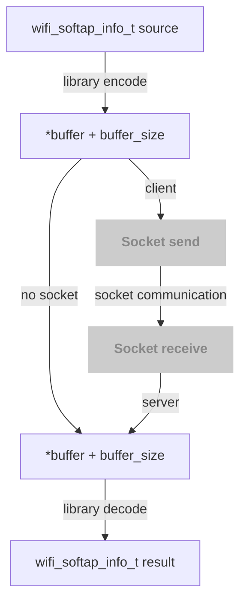
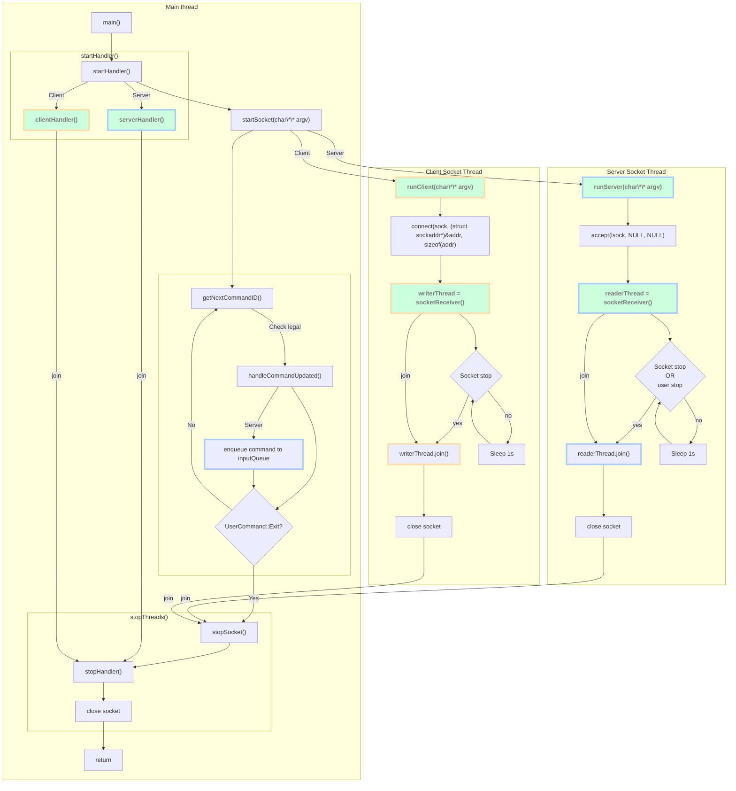
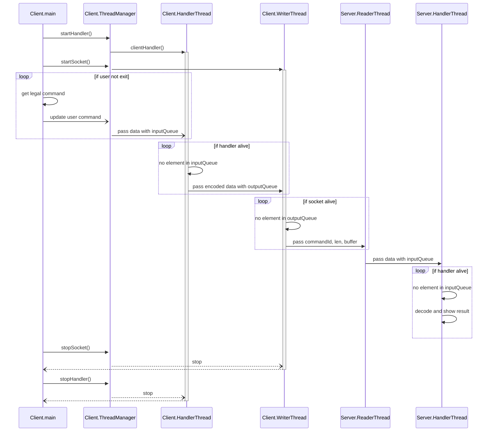

# serialization demo for c with libraries
Use same sample structure and encode / decode by the libries, and send the byte through socket

## Serialization Library
- [tpl](https://github.com/troydhanson/tpl)
- [mapck](https://github.com/ludocode/mpack)
- [nanopb](https://github.com/nanopb/nanopb)

## Compare
### Environment
- CPU: 12th Gen Intel Core i9-12900K
- RAM: 64G
- OS: Ubuntu 20.04.4 LTS

### Table
- The bytes are the size of the encoded result bytes from different size of structures
- The nanoseconds are the average time and standard deviation(Stddev) of 300000 executions

#### malloc buffer
| Library               | tpl                                                | mpack                                              | nanopb                                             |
| --------------------- | -------------------------------------------------- | -------------------------------------------------- | -------------------------------------------------- |
| license               | BSD license                                        | MIT license                                        | zlib License                                       |
| serializtion format   | tpl image                                          | MessagePack                                        | protobuf                                           |
| single structure      | 118 bytes<br>Mean: 734.51 ns<br>Stddev: 50.50 ns   | 46 bytes<br>Mean: 159.00 ns<br>Stddev: 18.31 ns    | 51 bytes<br>Mean: 539.95 ns<br>Stddev: 32.39 ns    |
| array of 2 structure  | 199 bytes<br>Mean: 1131.37 ns<br>Stddev: 185.32 ns | 97 bytes<br>Mean: 318.22 ns<br>Stddev: 248.23 ns   | 110 bytes<br>Mean: 1560.68 ns<br>Stddev: 176.31 ns |
| array of 10 structure | 791 bytes<br>Mean: 2799.08 ns<br>Stddev: 355.14 ns | 481 bytes<br>Mean: 1124.34 ns<br>Stddev: 385.39 ns | 550 bytes<br>Mean: 6732.55 ns<br>Stddev: 355.55 ns |

##### Coefficient of Variation
| Library               | tpl    | mpack        | nanopb |
| --------------------- | ------ | ------------ | ------ |
| single structure      | 6.88%  | 11.52%       | 6.00%  |
| array of 2 structure  | 16.38% | ***78.01%*** | 11.30% |
| array of 10 structure | 12.69% | ***34.28%*** | 6.20%  |

#### stack buffer
| Library               | tpl                                               | mpack                                            | nanopb                                             |
| --------------------- | ------------------------------------------------- | ------------------------------------------------ | -------------------------------------------------- |
| license               | BSD license                                       | MIT license                                      | zlib License                                       |
| serializtion format   | tpl image                                         | MessagePack                                      | protobuf                                           |
| single structure      | 118 bytes<br>Mean: 706.13 ns<br>Stddev: 28.68 ns  | 48 bytes<br>Mean: 116.90 ns<br>Stddev: 12.12 ns  | 53 bytes<br>Mean: 552.10 ns<br>Stddev: 33.00 ns    |
| array of 2 structure  | 199 bytes<br>Mean: 1014.94 ns<br>Stddev: 22.79 ns | 97 bytes<br>Mean: 214.71 ns<br>Stddev: 9.10 ns   | 110 bytes<br>Mean: 1478.16 ns<br>Stddev: 36.23 ns  |
| array of 10 structure | 791 bytes<br>Mean: 2376.62 ns<br>Stddev: 46.58 ns | 481 bytes<br>Mean: 837.03 ns<br>Stddev: 36.99 ns | 550 bytes<br>Mean: 6768.58 ns<br>Stddev: 129.90 ns |

##### Coefficient of Variation
| Library               | tpl   | mpack  | nanopb |
| --------------------- | ----- | ------ | ------ |
| single structure      | 4.06% | 10.37% | 5.98%  |
| array of 2 structure  | 2.25% | 4.24%  | 2.45%  |
| array of 10 structure | 1.96% | 4.42%  | 1.92%  |

## Usage
### Single run demo
```shell
usage: ./serialize_demo SHOW_STRUCTURE(0/1) LIBRARY COMMAND
LIBRARY: tpl|mpack|nanopb
COMMAND: benchmark_test [TEST_NUMBER]
         no_socket
         array_test [NUMBER]
         server PORT
         client HOST PORT
# e.g.
./serialize_demo 1 nanopb server 8888
./serialize_demo 1 mpack client "127.0.0.1" 8888 (need server exist)
./serialize_demo 1 tpl no_socket
./serialize_demo 1 tpl array_test
./serialize_demo 0 mpack benchmark_test 10000
```


```mermaid
graph TD;

    classDef socket fill:#CCC,color:#888,font-weight:bold,stroke-width:2px,stroke:#CCC
    source[wifi_softap_info_t source]-->|library encode| buffer1[*buffer + buffer_size];
    buffer1-->|client|socket_send[Socket send]:::socket;
    buffer1-->|no socket|buffer2;
    socket_send-->|socket communication|socket_receive[Socket receive]:::socket;
    socket_receive[Socket receive]-->|server|buffer2[*buffer + buffer_size]
    buffer2-->|library decode|result[wifi_softap_info_t result]
```

### Socket Client-Server Demo
- Similar to the [Single run demo](#single-run-demo), but uses `threads` and a `queue library` to handle the socket implementation
- The queue library is [moodycamel::ConcurrentQueue v1.0.4](https://github.com/cameron314/concurrentqueue)
    - `InputQueue`: Passes data to the handler thread for encoding or decoding
    - `OutputQueue`: Passes data for the socket writer thread
- Main Thread: Starts both the handler and socket threads, then awaits a user input command
- Management of the handler thread: **ThreadManager::startHandler()**, **ThreadManager::stopHandler()**
- Management of the socket thread: **ThreadManager::startSocket(char\*\* argv)**, **ThreadManager::stopSocket()**
    - Responds by starting a *reader* or *writer* thread based on whether the application is a server or a client
- Stopping all threads: **ThreadManager::stopThreads()**

#### Server
- If the user does not input `0` to exit, the server will wait for a client to connect and attempt to read and decode data
- It will retry to accept the next connection after a previous client has disconnected
- Queue:
    - **InputQueue**: Passes incoming data from the socket to the handler thread for decoding
- Threads:
    - Main Thread: Only accepts `UserCommand::Exit (0)`
    - Handler Thread:
        - Runnable: **ThreadManager::serverHandler()**
        - Awaits dequeueing from the **inputQueue** with a timeout(1s), and stays alive if **isHandlerRunning** is `true`
        - Responds by decoding using `static int decode(const char* library, void* buf, size_t sz, wifi_softap_info_t* out_info)` and showing the result
    - Socket Thread:
        - Runnable: **ThreadManager::runServer(char\*\* argv)**
        - Awaits a client connection and starts the reader thread; the thread keeps alive if the user does not input `UserCommand::EXIT`
    - Reader Thread:
        - Runnable: **ThreadManager::socketReceiver()**
        - Receives the **commandId**, **buffer size** of the data, and the **data** in order

#### Client
- Encodes a sample structure based on the user input command and sends it to the server
- Queue:
    - **InputQueue**: Passes the user input command to the handler thread for encoding
    - **outputQueue**: Passes encoded data from the handler thread to the writer thread for sending
- Threads:
    - Main Thread: Accepts commands from `UserCommand::Exit (0)` to `UserCommand::NANOPB_TEN_STRUCTURES_ARRAY (9)`
    - Handler Thread:
        - Runnable: **ThreadManager::clientHandler()**
        - Awaits dequeueing from the **inputQueue** with a timeout(1s), and stays alive if **isHandlerRunning** is `true`
        - Responds by encoding using`static int encode(const char* library, wifi_softap_info_t* info, void* out_buffer, size_t* out_size)`
    - Socket Thread:
        - Runnable: **ThreadManager::runClient(char\*\* argv)**
        - Connects to the server and starts the writer thread; the thread keeps alive if the socket is still working or the user does not input `UserCommand::EXIT`
    - Writer Thread:
        - Runnable: **ThreadManager::socketWriter()**
        - Awaits dequeueing from the **inputQueue** with a timeout(1s), then sends the **commandId**, **buffer size** of the data, and the **data** in order

#### poll() timeout
- The server uses `poll()` with a 1-second timeout to check for remote connections, so that user input (0: Exit) does not get blocked by `accept()`
- The client uses `poll()` with a 500-millisecond timeout to detect whether the server has closed the connection, in case user input blocks termination
- A readerThread is added on the client side to monitor the socket status from the server

#### How to Run
```shell
usage: ./serialize_demo_socket SHOW_STRUCTURE(0/1) <server PORT|client HOST PORT>

# server
./serialize_demo_socket 1 server 8888
(getNextCommandID) Waiting for command... (0:Exit)

# client
./serialize_demo_socket 1 client 127.0.0.1 8888
(getNextCommandID) Waiting for command... (0:Exit,
 TPL   : 1:Single Structure, 2:Two Structures Array, 3:Ten Structures Array,
 MPACK : 4:Single Structure, 5:Two Structures Array, 6:Ten Structures Array,
 NANOPB: 7:Single Structure, 8:Two Structures Array, 9:Ten Structures Array)
```

#### Graphic
#### FlowChart

```mermaid
flowchart TB
classDef thread fill:#CFD,color:#777,font-weight:bold
classDef server stroke-width:4px,stroke:#ACF
classDef client stroke-width:4px,stroke:#FDA

startHandler["startHandler()"]
serverHandler["serverHandler()"]:::thread
serverHandler:::server
clientHandler["clientHandler()"]:::thread
clientHandler:::client
startSocket["startSocket(char\*\* argv)"]
runServer["runServer(char\*\* argv)"]:::thread
runServer:::server
runClient["runClient(char\*\* argv)"]:::thread
runClient:::client
userInput["getNextCommandID()"]
inputUpdate["handleCommandUpdated()"]
isExit{"UserCommand::Exit?"}
enqueueCommand["enqueue command to inputQueue"]
enqueueCommand:::server
startReaderThread["readerThread = socketReceiver()"]:::thread
startReaderThread:::server
serverStop{
Socket stop
OR
user stop}
readerJoin["readerThread.join()"]:::server
startWriterThread["writerThread = socketReceiver()"]:::thread
startWriterThread:::client
clientStop{Socket stop}
writerJoin["writerThread.join()"]:::client

%% START the flowChart
subgraph mainP[Main thread]
    main["main()"]-->startHandler
    subgraph handler["startHandler()"]
        startHandler--Client-->clientHandler
        startHandler--Server-->serverHandler
    end

    startHandler-->startSocket
    startSocket-->userInput

    subgraph whileInput[ ]
        userInput--Check legal-->inputUpdate
        inputUpdate-->isExit
        inputUpdate--Server-->enqueueCommand
        enqueueCommand-->isExit
        isExit--No -->userInput
    end

    isExit--Yes-->stopSocket["stopSocket()"]

    subgraph stopP["stopThreads()"]
        stopSocket-->stopHandler["stopHandler()"]
        stopHandler-->socketClose["close socket"]
    end
    serverHandler--join-->stopHandler
    clientHandler--join-->stopHandler
    socketClose-->return["return"]
end

startSocket--Server-->runServer
startSocket--Client-->runClient

subgraph sreverSocketThread[Server Socket Thread]
    runServer-->accept["accept(lsock, NULL, NULL)"]
    accept-->startReaderThread
    startReaderThread-->serverStop
    serverStop--no -->sleep["Sleep 1s"]
    sleep-->serverStop
    serverStop--yes-->readerJoin
    startReaderThread--join-->readerJoin
    readerJoin-->s_sclose["close socket"]
end

subgraph clientSocketThread[Client Socket Thread]
    runClient-->connect["connect(sock, (struct sockaddr*)&addr, sizeof(addr)"]
    connect-->startWriterThread
    startWriterThread-->clientStop
    clientStop--no -->sleep_c["Sleep 1s"]
    sleep_c-->clientStop
    clientStop--yes-->writerJoin
    startWriterThread--join-->writerJoin
    writerJoin-->c_sclose["close socket"]
end
s_sclose--join-->stopSocket
c_sclose--join-->stopSocket
```

#### Sequence Diagram

```mermaid
sequenceDiagram
    Client.main->>Client.ThreadManager: startHandler()
    Client.ThreadManager->>+Client.HandlerThread: clientHandler()
    Client.main->>+Client.ThreadManager: startSocket()

    Client.ThreadManager->>+Client.WriterThread:
    loop if user not exit
        Client.main->>Client.main: get legal command
        Client.main-)Client.ThreadManager: update user command
        Client.ThreadManager-)Client.HandlerThread: pass data with inputQueue
    end


    loop if handler alive
        Client.HandlerThread->>Client.HandlerThread: no element in inputQueue
        Client.HandlerThread->>Client.WriterThread: pass encoded data with outputQueue
    end

    loop if socket alive
        Client.WriterThread->>Client.WriterThread: no element in outputQueue
        Client.WriterThread->>Server.ReaderThread: pass commandId, len, buffer
    end

    Server.ReaderThread->>Server.HandlerThread: pass data with inputQueue

    loop if handler alive
        Server.HandlerThread->>Server.HandlerThread: no element in inputQueue
        Server.HandlerThread->>Server.HandlerThread: decode and show result
    end

    Client.main->>Client.ThreadManager: stopSocket()
    Client.ThreadManager--)Client.WriterThread: stop
    Client.WriterThread--)-Client.main:
    Client.main->>Client.ThreadManager: stopHandler()
    Client.ThreadManager--)Client.HandlerThread: stop
    Client.HandlerThread--)-Client.main:
```

## Demo structure
- Target structure: `wifi_softap_info_t`
```c
/* WiFi scan results */
typedef enum {
    WIFI_AP_STATE_UNKNOWN = 0,
    WIFI_AP_STATE_DISABLED,
    WIFI_AP_STATE_ENABLED,
} wifi_softap_state_t;

/* IP address */
typedef struct {
    uint8_t ipv4[4];  /* IPv4 address in binary format (e.g., "192.168.1.1") */
    uint8_t ipv6[16]; /* IPv6 address in binary format (e.g.,
                         "fe80::1ff:fe23:4567:890a") */
} ip_addr_t;

/* WiFi security types */
typedef enum {
    WIFI_SECURITY_TYPE_NONE = 0, /* Open network */
    WIFI_SECURITY_TYPE_WEP,
    WIFI_SECURITY_TYPE_WPA,
} security_type_t;

/* WiFi SoftAP status */
typedef struct {
    int device_count;                       /* Number of connected devices */
    wifi_softap_state_t state;              /* Current state of the SoftAP */
    ip_addr_t ip_address;                   /* IP address of the SoftAP */
    char ssid[WIFI_SSID_MAX_LEN + 1];       /* SSID of the SoftAP */
    uint8_t bssid[WIFI_BT_MAC_ADDRESS_LEN]; /* BSSID of the SoftAP */
    security_type_t security;               /* Security type of the SoftAP */
    uint8_t channel;                        /* Channel of the SoftAP */
    uint16_t frequency;                     /* Frequency of the SoftAP (e.g., 2412 for 2.4GHz, 5180
                                               for 5GHz) */
} wifi_softap_info_t;
```

### socket function
```c
/*
 * socket_send
 *  - host: IP or hostname (we use inet_pton for simplicity; pass IP string)
 *  - portstr: decimal port string
 *  - buffer, size: payload to send
 *  - return 0 on success, -1 on failure
 */
static int socket_send(const char* host, const char* portstr, void* buffer, size_t size);

/*
 * socket_receive
 *  - portstr: port to listen
 *  - buffer: pointer to malloc'd buffer containing payload (returned)
 *  - size: payload size returned
 *  - returns 0 on success, -1 on failure
 *
 * Note: this function accepts one client connection and returns its payload.
 */
static int socket_receive(const char* portstr, void** buffer, size_t* size);
// for stack buffer
static int socket_receive(const char* portstr, void* buffer, size_t* size);
```

### encode / decode single structure
```c
/* encode the wifi_softap_info_t struct 
 * library: "tpl", "mpack", "nanopb"
 * out_buffer, out_size: output buffer and size
 * returns 0 on success
*/
static int encode(char* library, wifi_softap_info_t* info, void** out_buffer, size_t* out_size);
// for stack buffer
static int encode(char* library, wifi_softap_info_t* info, void* out_buffer, size_t* out_size);

/* decode the wifi_softap_info_t struct 
 * library: "tpl", "mpack", "nanopb"
 * buf, sz: input buffer and size
 * out_info: output struct
 * returns 0 on success
*/
static int decode(char* library, void* buf, size_t sz, wifi_softap_info_t* out_info);
```

### encode / decode structure array
```c
/* encode array of wifi_softap_info_t structs
 * library: "tpl", "mpack", "nanopb"
 * infos: input array of structs
 * count: number of structs
 * out_buffer, out_size: output buffer and size
 * returns 0 on success
 */
static int encode_array(char* library, const wifi_softap_info_t* infos, int count, void** out_buffer, size_t* out_size);
// for stack buffer
static int encode_array(char* library, const wifi_softap_info_t* infos, int count, void* out_buffer, size_t* out_size);

/* decode array of wifi_softap_info_t structs
 * library: "tpl", "mpack", "nanopb"
 * buf, sz: input buffer and size
 * out_infos: output array of structs
 * out_count: number of structs decoded
 * returns 0 on success
 */
static int decode_array(char* library, void* buf, size_t sz, wifi_softap_info_t** out_infos, int* out_count);
// for stack buffer
static int decode_array(char* library, void* buf, size_t sz, wifi_softap_info_t* out_infos, int* out_count);
```
