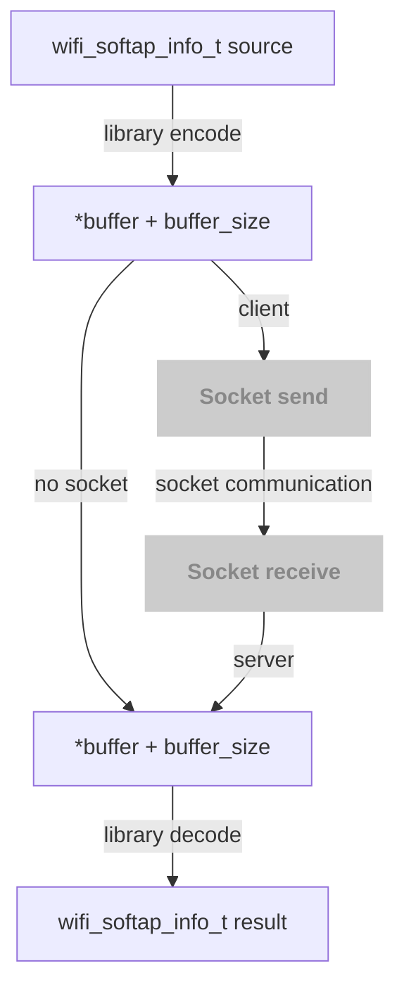
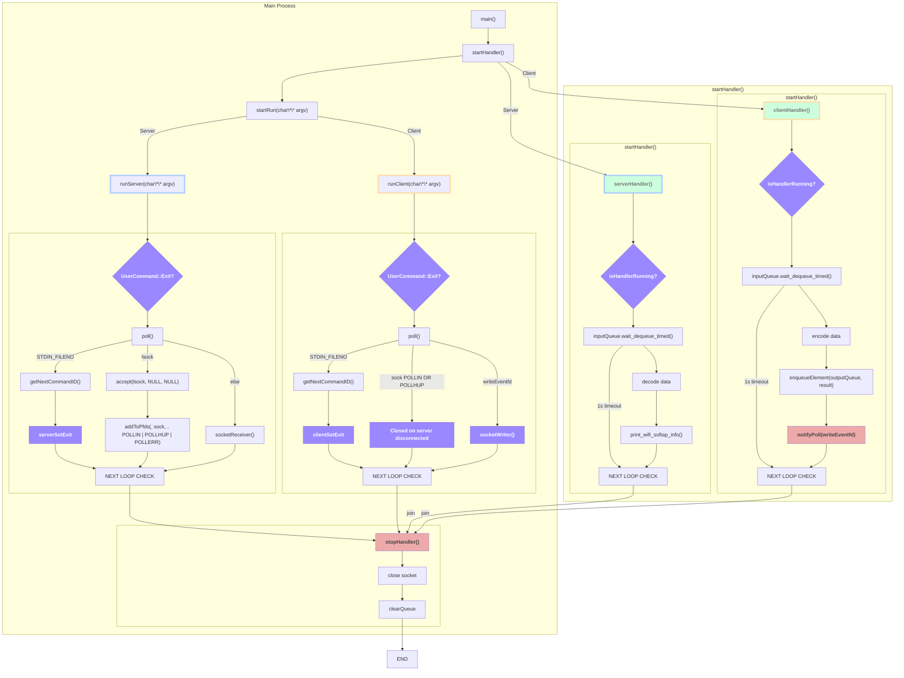

# serialization demo for c with libraries
Use same sample structure and encode / decode by the libries, and send the byte through socket

## Serialization Library
- [tpl](https://github.com/troydhanson/tpl)
- [mapck](https://github.com/ludocode/mpack)
- [nanopb](https://github.com/nanopb/nanopb)

## Compare
### Environment
- CPU: 12th Gen Intel Core i9-12900K
- RAM: 64G
- OS: Ubuntu 20.04.4 LTS

### Table
- The bytes are the size of the encoded result bytes from different size of structures
- The nanoseconds are the average time and standard deviation(Stddev) of 300000 executions

#### malloc buffer
| Library               | tpl                                                | mpack                                              | nanopb                                             |
| --------------------- | -------------------------------------------------- | -------------------------------------------------- | -------------------------------------------------- |
| license               | BSD license                                        | MIT license                                        | zlib License                                       |
| serializtion format   | tpl image                                          | MessagePack                                        | protobuf                                           |
| single structure      | 118 bytes<br>Mean: 734.51 ns<br>Stddev: 50.50 ns   | 46 bytes<br>Mean: 159.00 ns<br>Stddev: 18.31 ns    | 51 bytes<br>Mean: 539.95 ns<br>Stddev: 32.39 ns    |
| array of 2 structure  | 199 bytes<br>Mean: 1131.37 ns<br>Stddev: 185.32 ns | 97 bytes<br>Mean: 318.22 ns<br>Stddev: 248.23 ns   | 110 bytes<br>Mean: 1560.68 ns<br>Stddev: 176.31 ns |
| array of 10 structure | 791 bytes<br>Mean: 2799.08 ns<br>Stddev: 355.14 ns | 481 bytes<br>Mean: 1124.34 ns<br>Stddev: 385.39 ns | 550 bytes<br>Mean: 6732.55 ns<br>Stddev: 355.55 ns |

##### Coefficient of Variation
| Library               | tpl    | mpack        | nanopb |
| --------------------- | ------ | ------------ | ------ |
| single structure      | 6.88%  | 11.52%       | 6.00%  |
| array of 2 structure  | 16.38% | ***78.01%*** | 11.30% |
| array of 10 structure | 12.69% | ***34.28%*** | 6.20%  |

#### stack buffer
| Library               | tpl                                               | mpack                                            | nanopb                                             |
| --------------------- | ------------------------------------------------- | ------------------------------------------------ | -------------------------------------------------- |
| license               | BSD license                                       | MIT license                                      | zlib License                                       |
| serializtion format   | tpl image                                         | MessagePack                                      | protobuf                                           |
| single structure      | 118 bytes<br>Mean: 706.13 ns<br>Stddev: 28.68 ns  | 48 bytes<br>Mean: 116.90 ns<br>Stddev: 12.12 ns  | 53 bytes<br>Mean: 552.10 ns<br>Stddev: 33.00 ns    |
| array of 2 structure  | 199 bytes<br>Mean: 1014.94 ns<br>Stddev: 22.79 ns | 97 bytes<br>Mean: 214.71 ns<br>Stddev: 9.10 ns   | 110 bytes<br>Mean: 1478.16 ns<br>Stddev: 36.23 ns  |
| array of 10 structure | 791 bytes<br>Mean: 2376.62 ns<br>Stddev: 46.58 ns | 481 bytes<br>Mean: 837.03 ns<br>Stddev: 36.99 ns | 550 bytes<br>Mean: 6768.58 ns<br>Stddev: 129.90 ns |

##### Coefficient of Variation
| Library               | tpl   | mpack  | nanopb |
| --------------------- | ----- | ------ | ------ |
| single structure      | 4.06% | 10.37% | 5.98%  |
| array of 2 structure  | 2.25% | 4.24%  | 2.45%  |
| array of 10 structure | 1.96% | 4.42%  | 1.92%  |

## Usage
### Single run demo
```shell
usage: ./serialize_demo SHOW_STRUCTURE(0/1) LIBRARY COMMAND
LIBRARY: tpl|mpack|nanopb
COMMAND: benchmark_test [TEST_NUMBER]
         no_socket
         array_test [NUMBER]
         server PORT
         client HOST PORT
# e.g.
./serialize_demo 1 nanopb server 8888
./serialize_demo 1 mpack client "127.0.0.1" 8888 (need server exist)
./serialize_demo 1 tpl no_socket
./serialize_demo 1 tpl array_test
./serialize_demo 0 mpack benchmark_test 10000
```


```mermaid
graph TD;

    classDef socket fill:#CCC,color:#888,font-weight:bold,stroke-width:2px,stroke:#CCC
    source[wifi_softap_info_t source]-->|library encode| buffer1[*buffer + buffer_size];
    buffer1-->|client|socket_send[Socket send]:::socket;
    buffer1-->|no socket|buffer2;
    socket_send-->|socket communication|socket_receive[Socket receive]:::socket;
    socket_receive[Socket receive]-->|server|buffer2[*buffer + buffer_size]
    buffer2-->|library decode|result[wifi_softap_info_t result]
```

### Socket Client-Server Demo
- Similar to the [Single run demo](#single-run-demo), but uses `threads` and a `queue library` to implement socket handling
- The queue library is [moodycamel::ConcurrentQueue v1.0.4](https://github.com/cameron314/concurrentqueue)
    - `InputQueue`: Passes data to the handler thread for encoding or decoding
    - `OutputQueue`: Passes data for the socket writer thread
- Main Thread: Starts the handler, prepares the server or client socket, and then uses `poll()` to wait for connections
- Management of the handler thread: **ThreadManager::startHandler()**, **ThreadManager::stopHandler()**
- Starts **ThreadManager::runServer(...)** or **ThreadManager::runClient(...)** depending on whether the application runs as a server or a client

#### Single-threaded Event Handling with poll() for I/O operations
- A single `poll()` call can be used to handle all I/O events, including:
    - User input (`STDIN`)
    - Listening socket `accept()` (server)
    - Connected socket `recv()`
    - Connected socket `send()` (client)
        - Uses `eventfd` to manually trigger `poll()` via **ThreadManager::notifyPoll(...)** for socket write requests from the handler thread
        - The `eventfd` is used only for event notification via `poll()`, not for data transmission
        - The data itself is stored in **concurrentqueue** for transfer
- By adopting this approach, the main thread, socket thread, reader thread, and writer thread (client only) can be merged into a single event loop, simplifying the overall architecture
    ```c++
    for (int i = 0; i < pfNum; i++) {
        if (pfs[i].revents & POLLHUP) {
            // Peer disconnected; handle cleanup if needed
        } else if (pfs[i].revents & POLLIN) {
            if (pfs[i].fd == lsock) {
                // Listening socket is ready: accept a new connection
                // Add the connected socket to the poll list
                addToPfds(pfs, sock, &pfNum, POLLIN | POLLHUP | POLLERR);
            } else if (pfs[i].fd == STDIN_FILENO) {
                // User input detected
            } else {
                // Connected socket is ready to receive data
            }
        }
    }
    ```
    ```c++
        notifyPoll(writeEventfd);

        ...

        if (pfs[i].fd == writeEventfd) {
            uint64_t u;
            ssize_t s = read(writeEventfd, &u, sizeof(uint64_t));  // clear the eventfd
            // Data is ready to be sent via the socket
        }
    ```

- No blocking calls are required to wait for user input or socket activity:
    - `poll()` itself becomes the unified synchronization point
    - There is no need to rely on blocking `read()`, `recv()`, or separate waiting mechanisms
- No timeout is required for `poll()`:
    - The event loop reacts only when actual events occur
    - There is no need to periodically wake up to check the status of other threads
- No artificial delays are needed:
    - There is no need to `sleep()` while waiting for socket disconnection or state changes
    - Socket lifecycle events (connect, disconnect, error) are naturally driven by `poll()` events such as `POLLHUP` or `POLLERR`
- Thread and state management are simplified:
    - The dedicated readerThread can be removed
    - Socket running flags used solely for inter-thread coordination are no longer necessary
    - Resource lifetime is managed deterministically within a single event loop
- Before calling `poll()`, the `pollfd` array should be set up using **ThreadManager::addToPfds(...)** and **ThreadManager::delFromPfds(...)**

#### Server
- If the user does not input `0` to exit, the server waits for a client to connect and attempts to read and decode incoming data
- After a client disconnects, the server retries accepting the next connection
- Queue:
    - **InputQueue**: Passes incoming data from the socket to the handler thread for decoding
- Handler Thread:
    - Runnable: **ThreadManager::serverHandler()**
    - Waits to dequeue from the **inputQueue** with a timeout (1s), and remains alive while **isHandlerRunning** is `true`
    - Decodes data using `static int decode(const char* library, void* buf, size_t sz, wifi_softap_info_t* out_info)` and prints the result
- **ThreadManager::runServer(char\*\* argv)**
    - User input (STDIN):
        - Accepts only `UserCommand::Exit (0)`
    - Listening socket `accept()`:
        - Adds the connected socket to the poll list
    - Connected socket `recv()`:
        - Calls **ThreadManager::socketReceiver()**
        - Receives the **commandId**, **buffer size**, and **data** in order


#### Client
- Encodes a sample structure based on the user input command and sends it to the server
- Queue:
    - **InputQueue**: Passes user input commands to the handler thread for encoding
    - **outputQueue**: Passes encoded data from the handler thread to the socket writer
- Handler Thread:
    - Runnable: **ThreadManager::clientHandler()**
    - Awaits dequeueing from the **inputQueue** with a timeout (1s), and remains alive while **isHandlerRunning** is `true`
    - Encodes data using `static int encode(const char* library, wifi_softap_info_t* info, void* out_buffer, size_t* out_size)`
- **ThreadManager::runClient(char\*\* argv)**
    - User input (STDIN):
        - Accepts commands from `UserCommand::Exit (0)` to `UserCommand::NANOPB_TEN_STRUCTURES_ARRAY (9)`
    - Connected socket `recv()`:
        - Used only to detect whether the server has closed gracefully; it does not read any data
    - Connected socket `send()`:
        - Triggered by the handler thread via **ThreadManager::notifyPoll(...)**
        - Calls **ThreadManager::socketWriter()**
        - Attempts to dequeue from **OutputQueue**, then sends the **commandId**, **buffer size**, and **data** in order

#### How to Run
```shell
usage: ./serialize_demo_socket SHOW_STRUCTURE(0/1) <server PORT|client HOST PORT>

# server
./serialize_demo_socket 1 server 8888
## Wait for client to send data...
Server only accepts 0 for Exit


# client
./serialize_demo_socket 1 client 127.0.0.1 8888
Client supports command from 0-9, 0:Exit,
 TPL   : 1:Single Structure, 2:Two Structures Array, 3:Ten Structures Array,
 MPACK : 4:Single Structure, 5:Two Structures Array, 6:Ten Structures Array,
 NANOPB: 7:Single Structure, 8:Two Structures Array, 9:Ten Structures Array)
```

#### Graphic
#### FlowChart

```mermaid
flowchart TB
classDef thread fill:#CFD,color:#777,font-weight:bold
classDef condition fill:#98F,color:#FFF,font-weight:bold
classDef server stroke-width:4px,stroke:#ACF
classDef client stroke-width:4px,stroke:#FDA
classDef crossThread fill:#EAA,color:#444,font-weight:bold


startHandler["startHandler()"]
stopHandler["stopHandler()"]:::crossThread
serverHandler["serverHandler()"]:::thread
serverHandler:::server
clientHandler["clientHandler()"]:::thread
clientHandler:::client

startRun["startRun(char\*\* argv)"]
runServer["runServer(char\*\* argv)"]
runServer:::server
runClient["runClient(char\*\* argv)"]
runClient:::client

serverExitCheck{"UserCommand::Exit?"}:::condition
clientExitCheck{"UserCommand::Exit?"}:::condition
serverPoll["poll()"]
clientPoll["poll()"]
serverUserInput["getNextCommandID()"]
clientUserInput["getNextCommandID()"]

serverHandlerExitCheck{"isHandlerRunning?"}:::condition
clientHandlerExitCheck{"isHandlerRunning?"}:::condition


%% START the flowChart
subgraph mainP[Main Process]
    main["main()"]-->startHandler
    startHandler-->startRun
    startRun--Server-->runServer
    startRun--Client-->runClient

    %% runServer Poll LOOP
    runServer-->serverExitCheck{"UserCommand::Exit?"}:::condition
    subgraph ServerPollLoop[ ]
        serverExitCheck-->serverPoll
        serverPoll--STDIN_FILENO-->serverUserInput
        serverUserInput-->serverSetExit:::condition
        serverSetExit-->serverNextLoop["NEXT LOOP CHECK"]

        serverPoll--lsock-->accept["accept(lsock, NULL, NULL)"]
        accept-->addSocketPf["addToPfds(, sock, , POLLIN | POLLHUP | POLLERR)"]
        addSocketPf-->serverNextLoop

        serverPoll--else-->serverRecv["socketReceiver()"]
        serverRecv-->serverNextLoop
    end
    serverNextLoop-->stopHandler

    %% runClient Poll LOOP
    runClient-->clientExitCheck
    subgraph ClientPollLoop[ ]
        clientExitCheck-->clientPoll
        clientPoll--STDIN_FILENO-->clientUserInput
        clientUserInput-->clientSetExit:::condition
        clientSetExit-->clientNextLoop["NEXT LOOP CHECK"]

        clientPoll--sock POLLIN OR POLLHUP-->clientDisconnected["Closed on server disconnected"]:::condition
        clientDisconnected-->clientNextLoop

        clientPoll--writeEventfd-->clientSend["socketWriter()"]:::condition
        clientSend-->clientNextLoop
    end
    clientNextLoop-->stopHandler

    %% main STOP
    subgraph stopP[ ]
        stopHandler-->socketClose["close socket"]
        socketClose-->clearQueue
    end
end

subgraph handlerThread["startHandler()"]
    startHandler--Client-->clientHandler
    startHandler--Server-->serverHandler

    subgraph serverHandlerThread["startHandler()"]
        serverHandler-->serverHandlerExitCheck
        serverHandlerExitCheck-->waitSeverInputQ["inputQueue.wait_dequeue_timed()"]
        waitSeverInputQ--1s timeout-->serverHandlerNextLoop["NEXT LOOP CHECK"]

        waitSeverInputQ-->decode["decode data"]
        decode-->printResult["print_wifi_softap_info()"]
        printResult-->serverHandlerNextLoop
    end


    subgraph clientHandlerThread["startHandler()"]
        clientHandler-->clientHandlerExitCheck
        clientHandlerExitCheck-->waitClientInputQ["inputQueue.wait_dequeue_timed()"]
        waitClientInputQ--1s timeout-->clientHandlerNextLoop["NEXT LOOP CHECK"]

        waitClientInputQ-->encode["encode data"]
        encode-->enqueueOutputQ["enqueueElement(outputQueue, result)"]
        enqueueOutputQ-->notifyPoll["notifyPoll(writeEventfd)"]:::crossThread
        notifyPoll-->clientHandlerNextLoop
    end
    serverHandlerNextLoop--join-->stopHandler
    clientHandlerNextLoop--join-->stopHandler
end

clearQueue-->END
```

## Demo structure
- Target structure: `wifi_softap_info_t`
```c
/* WiFi scan results */
typedef enum {
    WIFI_AP_STATE_UNKNOWN = 0,
    WIFI_AP_STATE_DISABLED,
    WIFI_AP_STATE_ENABLED,
} wifi_softap_state_t;

/* IP address */
typedef struct {
    uint8_t ipv4[4];  /* IPv4 address in binary format (e.g., "192.168.1.1") */
    uint8_t ipv6[16]; /* IPv6 address in binary format (e.g.,
                         "fe80::1ff:fe23:4567:890a") */
} ip_addr_t;

/* WiFi security types */
typedef enum {
    WIFI_SECURITY_TYPE_NONE = 0, /* Open network */
    WIFI_SECURITY_TYPE_WEP,
    WIFI_SECURITY_TYPE_WPA,
} security_type_t;

/* WiFi SoftAP status */
typedef struct {
    int device_count;                       /* Number of connected devices */
    wifi_softap_state_t state;              /* Current state of the SoftAP */
    ip_addr_t ip_address;                   /* IP address of the SoftAP */
    char ssid[WIFI_SSID_MAX_LEN + 1];       /* SSID of the SoftAP */
    uint8_t bssid[WIFI_BT_MAC_ADDRESS_LEN]; /* BSSID of the SoftAP */
    security_type_t security;               /* Security type of the SoftAP */
    uint8_t channel;                        /* Channel of the SoftAP */
    uint16_t frequency;                     /* Frequency of the SoftAP (e.g., 2412 for 2.4GHz, 5180
                                               for 5GHz) */
} wifi_softap_info_t;
```

### socket function
```c
/*
 * socket_send
 *  - host: IP or hostname (we use inet_pton for simplicity; pass IP string)
 *  - portstr: decimal port string
 *  - buffer, size: payload to send
 *  - return 0 on success, -1 on failure
 */
static int socket_send(const char* host, const char* portstr, void* buffer, size_t size);

/*
 * socket_receive
 *  - portstr: port to listen
 *  - buffer: pointer to malloc'd buffer containing payload (returned)
 *  - size: payload size returned
 *  - returns 0 on success, -1 on failure
 *
 * Note: this function accepts one client connection and returns its payload.
 */
static int socket_receive(const char* portstr, void** buffer, size_t* size);
// for stack buffer
static int socket_receive(const char* portstr, void* buffer, size_t* size);
```

### encode / decode single structure
```c
/* encode the wifi_softap_info_t struct
 * library: "tpl", "mpack", "nanopb"
 * out_buffer, out_size: output buffer and size
 * returns 0 on success
*/
static int encode(char* library, wifi_softap_info_t* info, void** out_buffer, size_t* out_size);
// for stack buffer
static int encode(char* library, wifi_softap_info_t* info, void* out_buffer, size_t* out_size);

/* decode the wifi_softap_info_t struct
 * library: "tpl", "mpack", "nanopb"
 * buf, sz: input buffer and size
 * out_info: output struct
 * returns 0 on success
*/
static int decode(char* library, void* buf, size_t sz, wifi_softap_info_t* out_info);
```

### encode / decode structure array
```c
/* encode array of wifi_softap_info_t structs
 * library: "tpl", "mpack", "nanopb"
 * infos: input array of structs
 * count: number of structs
 * out_buffer, out_size: output buffer and size
 * returns 0 on success
 */
static int encode_array(char* library, const wifi_softap_info_t* infos, int count, void** out_buffer, size_t* out_size);
// for stack buffer
static int encode_array(char* library, const wifi_softap_info_t* infos, int count, void* out_buffer, size_t* out_size);

/* decode array of wifi_softap_info_t structs
 * library: "tpl", "mpack", "nanopb"
 * buf, sz: input buffer and size
 * out_infos: output array of structs
 * out_count: number of structs decoded
 * returns 0 on success
 */
static int decode_array(char* library, void* buf, size_t sz, wifi_softap_info_t** out_infos, int* out_count);
// for stack buffer
static int decode_array(char* library, void* buf, size_t sz, wifi_softap_info_t* out_infos, int* out_count);
```
